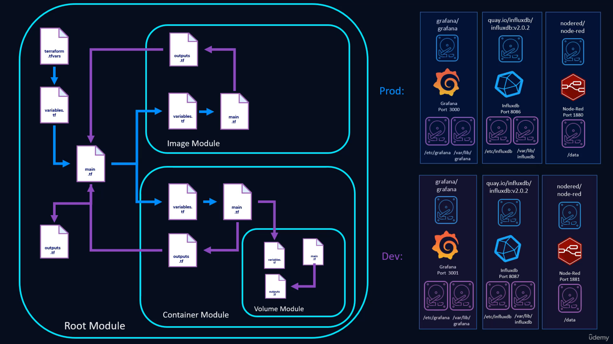

# More than Certified in Terraform  - Course Project Repository

## Section 3: Modular Deployments (terraform-docker folder)

- Creates a weather dashboard using node-red, influxdb, and grafana docker containers
- Uses a "image" module for the container image resources
- Uses a "container" module with a nested "volume" module for creating the containers with persistant volumes
- Key concepts include writing DRY Terraform code, passing outputs between modules, using provisioners, iterating through object variables, using dynamic blocks, and using workspaces

## Section 4: Deploy AWS Resources with Terraform (terraform-aws folder)

- Same concept of a weather dashboard using containers, but this time deployed on K3 instances on AWS
- Uses nodered to pull from the openweather map api, insert the data into influxdb, and then use grafana to graph the data
- Containers are deployed to K3s using local config file
- Includes modules for:
  - networking: Creates the VPC, public/private subnets, internet gateway, security groups, subnet groups (for RDS)
  - loadbalancing: Creates the ALB, target groups, and listeners for load balancing between K3 nodes
  - database: Creates the RDS MySQL database used for K3s
  - compute: Uses Ubuntu AMI to deploy instances, bootstraps them with K3s and adds them to the ALB target group
- Terraform Cloud is used as the remote state backend for this deployment
- AWS role used for deployment is created with least privileges required and assumed by AWS user. Local credentials are secured with AWS vault

## Section 5: Deploying Kubernets Resources with Terraform (terraform-k8s folder)

- Same weather dashboard using containers, but this time deployed on K8s

## Section 6: Continous Deployment using Terraform Cloud (terraform-cicd folder)

- Create AWS modules for networking and compute hosted in GitHub. Create modules in Terraform Cloud (TFC) backed by the Github repos.
- Create GitHub repo, TFC Oauth client (Github), and a TFC workspace all using Terraform
- Use the TFC workspace to deploy compute and networking using the modules when a commit is made in the GitHub repository